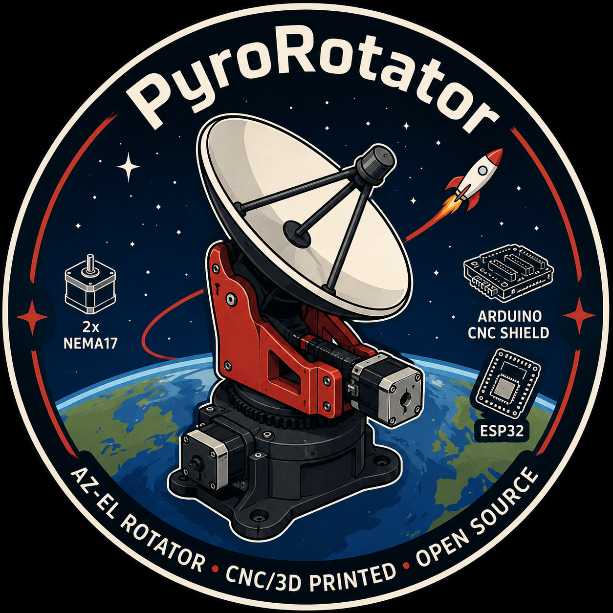

  

# PyroRotator

ESP32 Az/El antenna-rotator firmware — PJ4 · PyroLabs. CNC/3D-printed, open source.

Open-loop NEMA 17 steppers driven by TMC2209s in **standalone** mode (StealthChop2 +
1/256 MicroPlyer → silent, smooth tracking, no UART wiring), EL limit-switch homing,
azimuth zero set by compass. It's the hardware end of
[SkyPhreak](https://github.com/Pyrodrifter/SkyPhreak)'s continuous-motion **SuperRot**
protocol, and also speaks rotctld and EasyComm so it works with SatDump, SkyRoof,
Gpredict, etc.

## Control surfaces
- **Web app** — `http://rotator.local/` — manual control, live status, protocol toggle.
- **TCP `:4533`** — `rotctld` (Hamlib net-rotctl) **or** **SuperRot** continuous motion
  (`A/V/P/S/K/?`), chosen in the web app. Protocol spec: [SUPERROT.md](SUPERROT.md).
- **USB serial @ 9600** — EasyComm II (e.g. SkyRoof via `rotctld -m 202`).

## Bill of materials
- **ESP32-WROOM-32** dev board (38-pin, CP2102 USB).
- **Arduino CNC Shield V3** on a Uno-form-factor carrier (the ESP32 sits on the carrier).
- **2× TMC2209** stepper drivers — run in **standalone** mode (microsteps set by the
  shield's MS1/MS2 jumpers; coil current set by each driver's Vref pot).
- **2× NEMA 17** steppers (azimuth + elevation).
- **1× limit switch** for elevation homing (azimuth zero is set by hand/compass).
- **12–36 V** PSU for the motors.
- 3D-printed mechanics + a printed ring gear / pinion for each axis.

> The common red "CNC Shield kit" (Uno + shield + drivers + 3× NEMA17 + endstops)
> covers most of this — just swap the included A4988s for **TMC2209s**, which this
> firmware is tuned for.

## Pin map (ESP32 → CNC Shield)
| Function | GPIO | Notes |
|---|---|---|
| AZ&nbsp;STEP / DIR | 25 / 26 | X axis |
| EL&nbsp;STEP / DIR | 27 / 14 | Y axis |
| Driver enable | 13 | active **LOW** (LOW = enabled) |
| EL limit switch | 33 | `INPUT_PULLUP`, switch to GND (active LOW) |
| AZ limit (reserved) | 32 | az zero is compass-set, not switched |

Microstepping is set by the **MS1/MS2 jumpers** on the shield and must match
`MICROSTEP` in the sketch (default 1/8). Full ESP32 + CNC-shield pinout:
[docs/ESP32_CNC_Shield_Pinout.pdf](docs/ESP32_CNC_Shield_Pinout.pdf).

## Build & flash
- Board: **ESP32 Dev Module** (Arduino IDE or arduino-cli).
- Library: **AccelStepper** (everything else is ESP32 core).
- Edit the `CONFIG` block at the top of `PyroRotator.ino`: WiFi creds, gear ratios
  (`GEAR_AZ`/`GEAR_EL`), `MICROSTEP` (match the jumpers), travel limits, homing.
- Flash, then browse to `http://rotator.local/`.

## Motion notes
- **Azimuth travel 0–450°** (90° overlap past a full turn). The host streams
  **continuous (unwrapped)** azimuth and owns trajectory continuity; the firmware
  positions **absolutely** and does not wrap — so a pass can cross north without
  unwinding. Unwind the cable manually (or via SkyPhreak's auto-unwind) when wound
  near the limit.
- **Two-stage homing**: fast seek → back off → slow gentle re-approach, so contact is
  soft and repeatable (no hard press / skipped step). Homing aborts and flags an error
  (no false zero) if the switch isn't found.

## Files
- `PyroRotator.ino` — firmware.
- `index_html.h` — embedded web UI (kept out of the `.ino` so Arduino's preprocessor
  doesn't choke on the raw-string HTML).
- `SUPERROT.md` — SuperRot continuous-motion protocol spec.
- `docs/` — logo, pinout PDF, and renders.

## License
Open source — see the repository.
